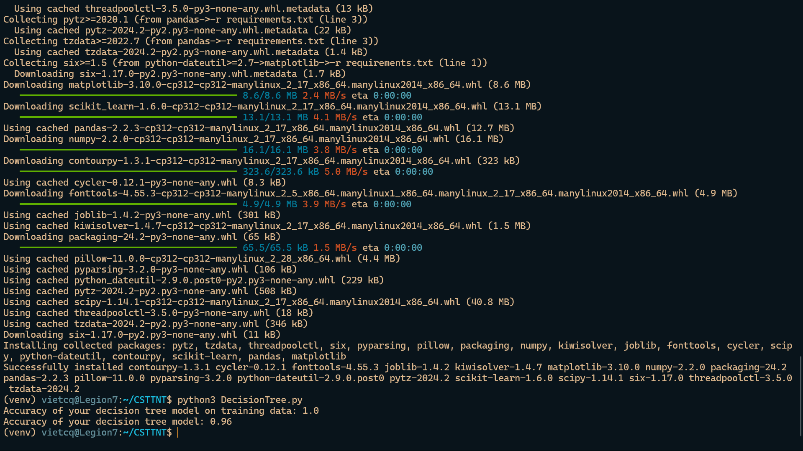

# Decision Tree Classifier

## Demo


## Project Structure
- `DecisionTree.py`: Main script for building and evaluating the Decision Tree classifier.
- `output.png`: Demo result image.
- `requirements.txt`: Contains the necessary dependencies.
- `venv/`: Virtual environment directory.

## Cloning the Repository

Clone the repository using the following command:

```bash
git clone https://github.com/CaoQuocViet/csttnt-hcmus-decision-tree.git
```

## Setting up the Virtual Environment

Navigate to the project directory and create a virtual environment:

```bash
cd csttnt-hcmus-decision-tree
python3 -m venv venv
```

Activate the virtual environment:

For Linux/macOS:
```bash
source venv/bin/activate
```

For Windows:
```bash
venv\Scripts\activate
```

## Installing Dependencies

Install the necessary dependencies from the `requirements.txt` file:

```bash
pip install -r requirements.txt
```

## Running the Model

Run the model script with the following command:

```bash
python DecisionTree.py
```

## Contributing

Contributions are welcome! Please fork the repository and submit a pull request for any enhancements or bug fixes.

## License

This project is licensed under the MIT License. See the LICENSE file for details.
